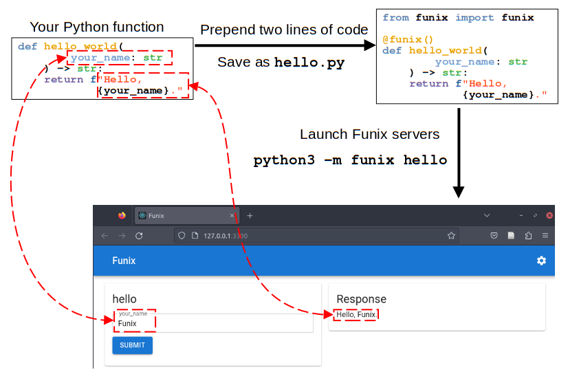
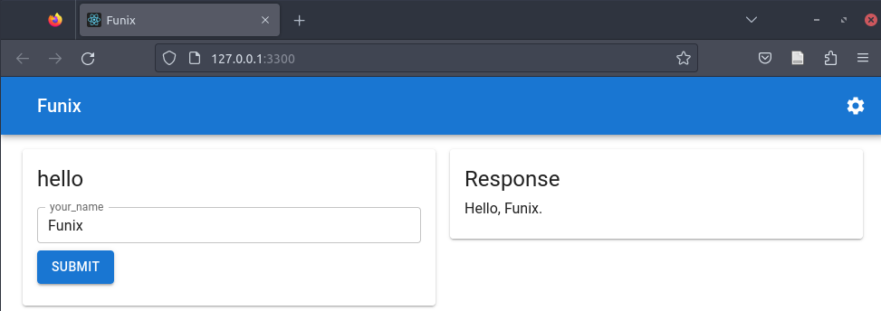
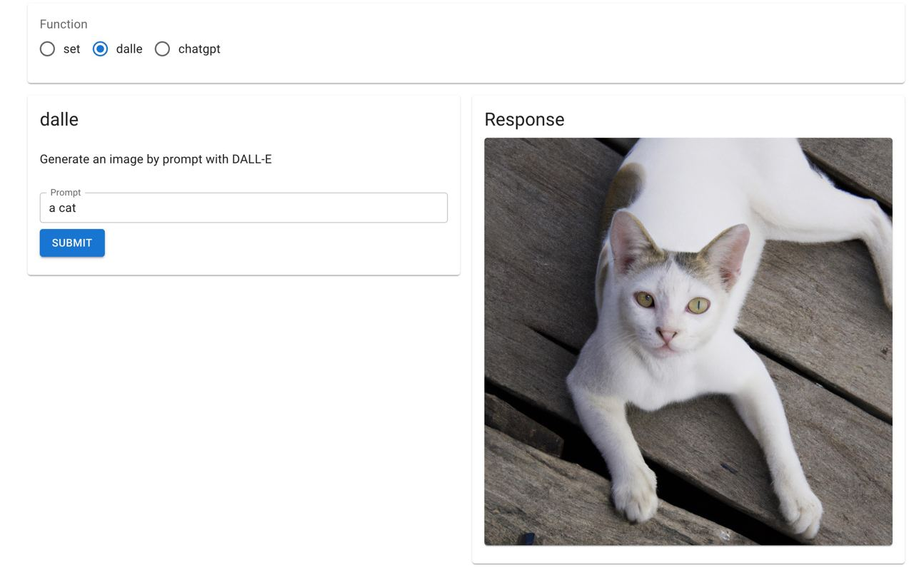
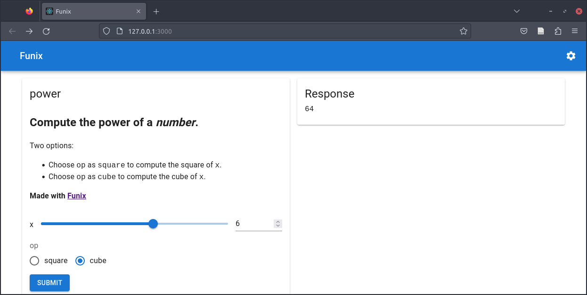
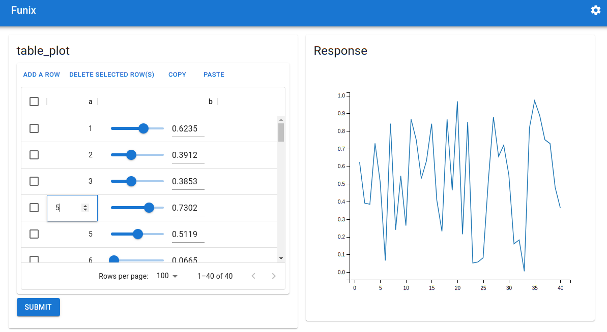
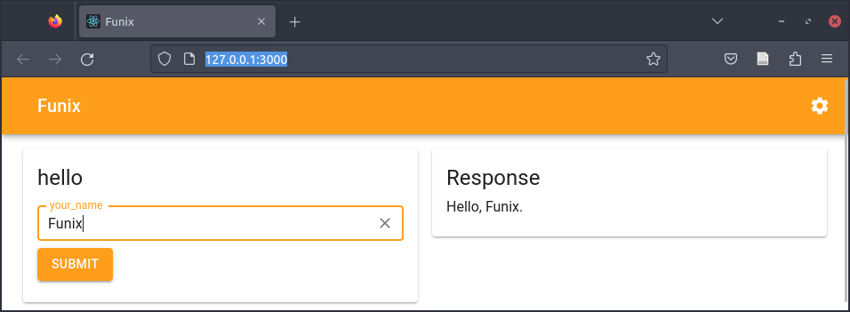
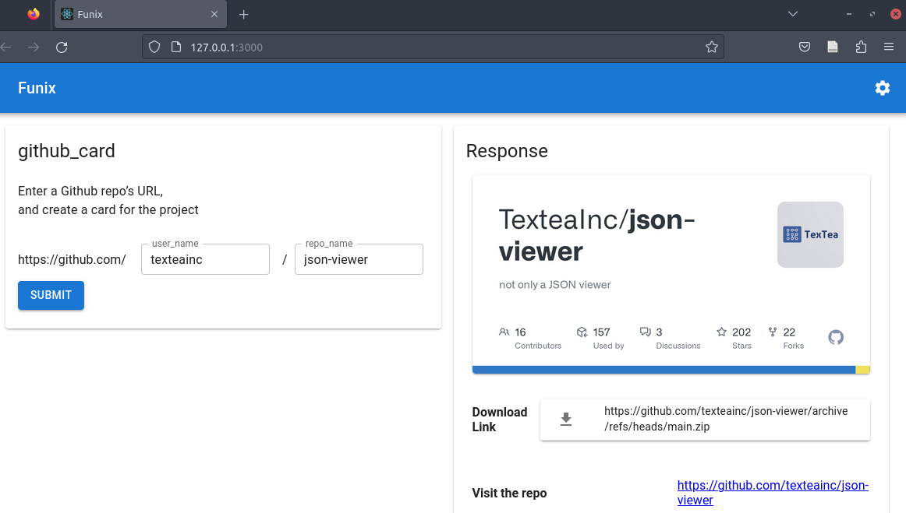
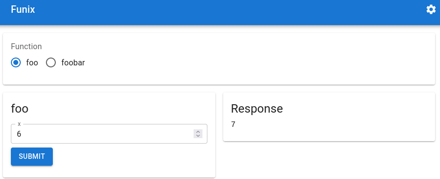
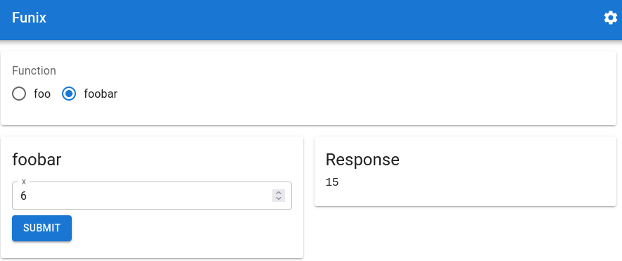

# The Quick Start Guide of Funix 

Your Python function definition is your web app!



[Watch 1-minute Funix intro video on YouTube](https://youtu.be/UGp5gbR8f3c)

## Introduction

* Build web apps directly from your core logic in Python, without bothering with the front-end or web UI.
* In **as few as two lines of code**, turn any Python function into a web app via Funix.
* UI customization available in declarative fashion in JSON5 or YAML. Themes supported too. 
* How: Funix automatically chooses I/O widgets for your web app by analyzing the type hint in your function's signature. 
* Non-intrusive: you can still run your code locally. 

## Acknowledgement
We were inspired by FastAPI's approach of using type hints to build apps. We also want to thank Streamlit, Gradio, PyWebIO, and Pynecone for their influence on the development of Funix. Our backend is implemented using Flask, and the front-end primarily using Material UI. Lastly, Funix was made possible with the generous investment from Miracle Plus (formerly Y Combinator China) to Textea Inc. 

## Installing Funix

```bash
pip install funix
```

or from Funix's GitHub repo

```bash
pip install "git+https://github.com/TexteaInc/funix.git"
```

## Just two more lines of code 

A type-hinted Python function can be turned into a web app by adding **as few as two lines of code**:
* importing a Funix decorator (e.g., `from funix import funix`)
* decorating the Python function using the decorator (e.g., `@funix()`). 

Below is an example (source code [here](./examples/hello.py)):

```python
from funix import funix # add line one

@funix()                # add line two 
def hello(your_name: str) -> str:
    return f"Hello, {your_name}."
```

Save the code above as `hello.py`.
Then run this at the terminal:

```bash
python3 -m funix hello
```

A web app will be launched at `http://localhost:80` and automatically opened in a browser window.



Wolla! Now anyone can use a Python function you write without knowing Python or having the computing environment. 

Note that on Linux, you may need  need to run the above command with `sudo` to use port 80. Or, you can use a port that does not need the root privilege, such as 3000:

```bash
python3 -m funix hello_world -P 3000
```

Then the web app will be launched at `http://localhost:3000`.

## Can Funix do AI? Of course! 
```python
from funix import funix
from funix.hint import Images
import openai  # pip install openai

openai.api_key = os.environ.get("OPENAI_KEY")

def dalle(prompt: str = "a cat") -> Images:
    response = openai.Image.create(prompt=prompt, n=1, size="1024x1024")
    return response["data"][0]["url"]
```




## Customizing UI made easy

Although Funix chooses widgets automatically, you can easily customize them. For example, the code ([here](./examples/power_slider_radio.py)) below uses a slider, between 0 and 10 with a step of 1, for the integer input `x` and uses a radio button to select the string input `op`. 
The return is a string but because its type is `funix.hint.Markdown`, it is rendered into rich text in the web app. 

This example also leverages Funix's JSON5 support to facilitate declarative UI customization. 
See more in the section [JSON5 and YAML support](#declarative-in-json5-and-yaml) below. 

```python
from funix.hint import Markdown
from funix import funix_json5
@funix_json5("""
{
    widgets: {
        x: "slider[0,10,1]",
        op: "radio" } , 
    whitelist: {
        op: ["square", "cube"] } 
}
"""
)

def power(x: int, op: str) -> Markdown:
    if op =="square":
        return  f"\
* The _square_ of {x} is **{x * x}**. \n \
* Made by [Funix](http://funix.io)"
    elif op == "cube":
        # return x * x * x
        return  f"\
* The _cube_ of {x} is **{x * x * x}**. \n \
* Made by [Funix](http://funix.io)"
```

The corresponding web app looks like below:



## Multi-modal and compound I/Os

Funix can support more than singular I/Os such as integers or strings.
The example below ([code here](./examples/slider_table_plot.py)) creates a table input and visualizes the two columns in a scatter plot. 
In particular, the widget for variable `a` is a column of input boxes while that for the variable `b` is a column of sliders. 


```python 
from typing import List 
import matplotlib.pyplot as plt

from funix import funix

@funix(
    widgets={
        "a": "sheet",
        "b": ["sheet", "slider[0,1,0.01]"],
    }
)
def table_plot(a: List[int], b: List[float]) -> plt.figure:
    fig = plt.figure()
    plt.plot(a, b)
    return fig
```

The corresponding web app looks like below.



Funix's table input widget supports copy-and-paste from/to a spreadsheet program, as shown in the GIF below. [Watch HD video on YouTube](https://youtu.be/4vcYZSXoeW0).


## Themes

Funix supports themes to provide a consistent UI across your web apps. The example below [code here](examples/theme.py) changes all widgets, including the top banner, to yellow from the default blue theme. Yes, Funix supports importing a theme from any web URL.

```python
from funix import funix
@funix(
    theme = "https://raw.githubusercontent.com/TexteaInc/funix-doc/main/examples/sunset_v2.yaml"
)
def hello(your_name: str) -> str:
    return f"Hello, {your_name}."
```

The corresponding web app looks like below, where the default blue theme is replaced with the yellow one.



## Customizing layouts

Two parameters are used for layout customization of the inputs and outputs respectively: `input_layout` and `output_layout`. 
Funix uses a row-based layput system. 
The input or output panel, a 2D list, is divided into rows, each of which is a list of dictionaries, each of which specifies a widget, where the keys are the properties of the widget. For more details, please refer to the Reference Manual. 

Below is an example ([code here](./examples/layout.py)). In `input_layout`, four widgets, two HTML code pieces and two arguments of the function decorated `github_card` are laid out in the same row with their respective widths. The Funix-decorated function `github_card` has returns of three types: an image, a file URL, and a markdown string, which are properly rendered in the output panel. 

```python
from funix import funix
from funix.hint import Images, Files, Markdown 

@funix(
    description="""Enter a Github repo's URL, 
    and create a card for the project""",
    input_layout=[
        [{"html": "https://github.com/", "width": 3.5},
         {"argument": "user_name", "width": 4},
         {"html": "/", "width": 0.2},
         {"argument": "repo_name", "width": 4},]
         # all in row 1
        ],
    output_layout=[
        [{"return": 0}], # row 1
        [{"markdown": "**Download Link**", "width": 2},
         {"return": 1}], # row 2
        [{"markdown": "**Visit the repo**"},
         {"return": 2}] # row 3
    ]
)
def github_card(user_name: str="texteainc", 
                repo_name: str="json-viewer") -> (Images, Files, Markdown):
    url = f"https://github.com/{user_name}/{repo_name}"
    author = url.split("/")[3]
    name = url.split("/")[4]
    return f"https://opengraph.githubassets.com/1/{author}/{name}", \
           f"{url}/archive/refs/heads/main.zip", \
           f"[{url}]({url})"
```

The corresponding web app looks like below: 



## Declarative in JSON5 and YAML 
Tired of the quotation marks and curly brakets? 
Besides the Python-based decorator `@funix`, Funix provides two addtional decorators `@funix_yaml` and `@funix_json5` in the YAML and JSON5 syntaxes. 

[The `power` function example above](#customizing-ui-made-easy) uses the JSON5 style. The corresponding Python and YAML versions are given below. 

```python
## If decorating in Python's syntax, 
## use the following:
from funix import funix
@funix(
    widgets={
        "x": "slider[0,10,1]",
        "op": "radio" }, 
    whitelist={"op": ["square", "cube"]}
)
          
## If decorating in YAML syntax,
## use the following:
from funix import funix_yaml
@funix_yaml("""
    widgets:
        x: slider[0,10,1]
        op: radio
    whitelist:
        op: 
            - square
            - cube
""")
```

## Customization per-attribute or per-IO

In all examples above, the configurations are aggregated per-attribute. This might be inconvenient when one needs to see all customizations of the same function I/O, and thus its corresponding widget, in one place.
Hence, Funix also supports per-IO customization.

To do so, just use the parameter `per_IO_config`, of type `dict`, and put per-IO congifurations in it. For example, the `power` function above can be decorated in the per-IO fashion as follows, in YAML syntax:

```python
from funix import funix_json5
@funix_json5("""
    argument_config": {
        x": {"widgets": "slider[0,10,1]"},
        op": {"widgets": "radio", 
              "whitelist": ["square", "cube"]}
    }
""")
```

In comparison, this is the per-attribute version:

```python
from funix import funix_json5
@funix_json5("""
{
    widgets: {
        x: "slider[0,10,1]",
        op: "radio" } , 
    whitelist: {
        op: ["square", "cube"] } 
}
""")
```

## Multiple functions in one Python script

You can mix Funix-decorated functions and normal functions in one Python script.
Only the decorated functions are converted to web apps. 
In a case of multiple Funix-decorated functions, a function selector will be provided at the top the Funix-generated web app.

For example, the following Python script [code here](./examples/multi_functions.py) contains two Funix-decorated functions, `foo` and `foobar`, and one normal function, `bar`. 

```python
from funix import funix
@funix() 
def foo(x: int) -> int:
    return x + 1 

# will NOT be converted to a web app
def bar(x: int) -> int:
    return x + 2

@funix()
def foobar(x: int) -> int:
    return foo(x) + bar(x)

if __name__ == "__main__":
    print(foobar(1))
```

The two screenshots below show the responses when the `foo` and `foobar` functions are selected respectively.




## Non-intrusive 

Funix is non-intrusive. You can run the Python script above, or call any function (Funix-decorated or not) in it,  on your terminal as usual. 

```bash
$ python3 multi_functions.py 
5
$ python3 -c "from multi_functions import foo; print (foo(6))"
7
```

## Backend 
Funix gives you both the frontend and the backend from the same piece of code. By default, the backend server is at `localhost:8080` and the endpoint for a function is at `/call/{your_function_name}`. For example, for the `foo` function we can POST to `localhost:8080/call/foo` and the result 7 is printed in the last line: 

```bash
$ curl -X POST  \
       -H "Content-Type: application/json" \
       -d '{"x": 6}' \
       localhost:8080/call/foo
7 
```


## More

For further details, please read our Reference Manual. 
If you have questions, please open an issue on Github.
