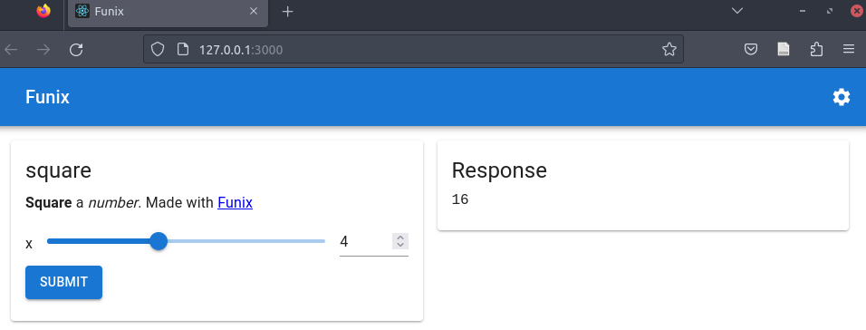

# The Quick Start Guide of Funix 

Your Python function definition is your web app! 


## Introduction

* Funix allows you to build web apps by focusing on your core logic in Python, without bothering about the front-end or web UI.
* With **as few as two more lines of code**, you can turn any Python function into a web app via Funix.
* Unlike other Python-based frameworks for building web apps, Funix does not require you to create widgets in Python. **Just focus on your core logic.**
* But if you need to customize the UI, you can do it declaratively in Python, YAML, or JSON. Themes can also be used to provide consistent UI across your web apps.
* How: Funix automatically chooses I/O widgets for your web app by analyzing the typing hint in your function's signature. 
* Open source under the MIT license.

## Acknowledgement
We were inspired by FastAPI's approach of using typing hints to build apps. We also want to thank Streamlit, Gradio, PyWebIO, and Pynecone for their influence on the development of Funix. Our backend is implemented using Flask, and the front-end primarily using Material UI. Lastly, Funix was made possible with the generous investment from Miracle Plus Fund I to Textea Inc. 

## Installing Funix

```bash
pip install funix
```

or from Funix's GitHub repo

```bash
pip install "git+https://github.com/TexteaInc/funix.git"
```

## Just two more lines of code 

A type-hinted Python function can be turned into a web app by adding **as few as two lines of code**:
* Import a Funix decorator (e.g., `from funix import funix`)
* decorate the Python function using the decorator (e.g., `@funix()`). 

Below is an example:

```python
from funix import funix # add line one

@funix()                # add line two 
def hello(your_name: str) -> str:
    return f"Hello, {your_name}."
```

Save the code above as `hello.py`.
Then run this at the terminal:

```bash
python3 -m funix hello
```

A web app will be launched at `http://localhost:80` and automatically opened in a browser window.


Wolla! Now anyone can use a Python function you write without knowing Python or having the computing environment. 

Note that on Linux, you may need  need to run the above command with `sudo` to use port 80. Or, you can use a port that does not need the root privilege, such as 3000:

```bash
python3 -m funix hello_world -P 3000
```

Then the web app will be launched at `http://localhost:3000`.

## Customizing UI is easy

Although Funix chooses widgets automatically, you can easily customize them. For example, the code ([here](./examples/slider_markdown.py)) below uses a slider, between 0 and 10 with a step of 1, for the integer input and adds a description to the app in Markdown:

```python
from funix import funix

@funix(
    widgets={"x": "slider[0,10,1]"}, 
    description="**Square** a _number_. Made with [Funix](http://funix.io)"
)
def square(x: int) -> int:
    return x * x
```

The corresponding web app looks like below:


TODO: More complex Markdown examples.


## Multi-modal and compound I/Os

Funix can support more than singular I/Os such as integers or strings.
The example below ([code here](./examples/slider_table_plot.py)) creates a table input and visualizes the two columns in a scatter plot. 

```python 
from typing import List 
import matplotlib.pyplot as plt

from funix import funix

@funix(
    widgets={
        "a": "sheet",
        "b": "sheet",
    }
)
def table_plot(a: List[int], b: List[float]) -> plt.figure:
    fig = plt.figure()
    plt.plot(a, b)
    return fig
```

The corresponding web app looks like below.


We further copied the data from a spreadsheet to the table to show off Funix' ability to function as a step in your data science workflow. 


TODO: Change the widget for `b` to `["sheet", "slider[0,1,0.01]"`. 

## Themes

Funix supports themes to provide consistent UI across your web apps. The example code below changes all widgets to yellow from the default blue theme:  

```python
from funix import funix
@funix(
    theme="https://yazawazi.moe/pdf_themes/sunset_v2.yaml"
)
def hello(your_name: str) -> str:
    return f"Hello, {your_name}."
```

## Customization layouts


## Whitelist and examples


**Only decorated functions are converted to web apps.**

**Multiple I/Os**


**Auto Mapping** 

