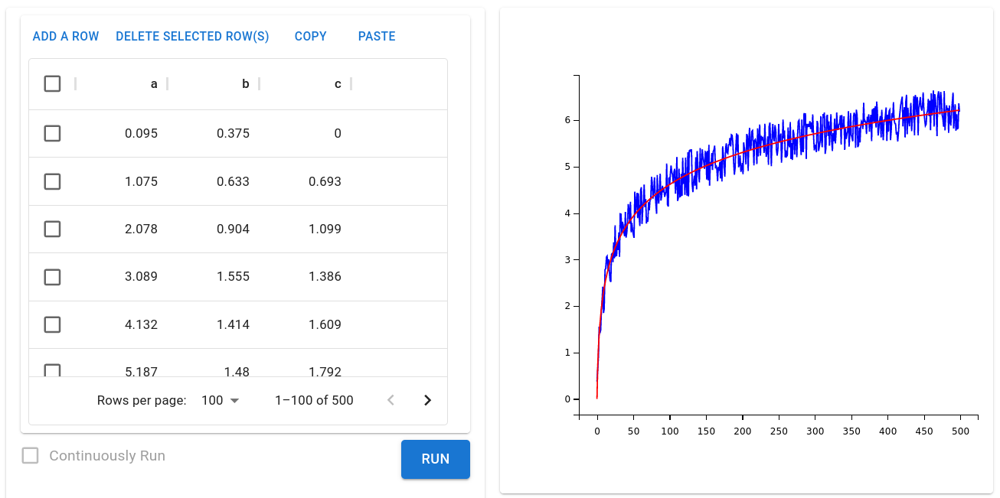

# The Quick Start Guide of Funix 

Your Python function definition is your web app! 


## Introduction

* Funix allows you to build web apps directly from your core logic in Python, without bothering with the front-end or web UI.
* With **as few as two more lines of code**, you can turn any Python function into a web app via Funix.
* Unlike other Python-based frameworks for building web apps, Funix does not require you to create widgets in Python. **Just focus on your core logic.**
* But if you need to customize the UI, you can do it declaratively in Python, YAML, or JSON. Themes can also be used to provide consistent UI across your web apps.
* How: Funix automatically chooses I/O widgets for your web app by analyzing the typing hint in your function's signature. 
* Open source under the MIT license.

## Acknowledgement
We were inspired by FastAPI's approach of using typing hints to build apps. We also want to thank Streamlit, Gradio, PyWebIO, and Pynecone for their influence on the development of Funix. Our backend is implemented using Flask, and the front-end primarily using Material UI. Lastly, Funix was made possible with the generous investment from Miracle Plus Fund I to Textea Inc. 

## Installing Funix

```bash
pip install funix
```

or from Funix's GitHub repo

```bash
pip install "git+https://github.com/TexteaInc/funix.git"
```

## Just two more lines of code 

A type-hinted Python function can be turned into a web app by adding **as few as two lines of code**:
* importing a Funix decorator (e.g., `from funix import funix`)
* decorating the Python function using the decorator (e.g., `@funix()`). 

Below is an example:

```python
from funix import funix # add line one

@funix()                # add line two 
def hello(your_name: str) -> str:
    return f"Hello, {your_name}."
```

Save the code above as `hello.py`.
Then run this at the terminal:

```bash
python3 -m funix hello
```

A web app will be launched at `http://localhost:80` and automatically opened in a browser window.


Wolla! Now anyone can use a Python function you write without knowing Python or having the computing environment. 

Note that on Linux, you may need  need to run the above command with `sudo` to use port 80. Or, you can use a port that does not need the root privilege, such as 3000:

```bash
python3 -m funix hello_world -P 3000
```

Then the web app will be launched at `http://localhost:3000`.

## Customizing UI is easy

Although Funix chooses widgets automatically, you can easily customize them. For example, the code ([here](./examples/power_slider_radio.py)) below 
* uses a slider, between 0 and 10 with a step of 1, for the integer input, 
* adds a help message in Markdown
* and finally uses a radio button to select between two options. 

```python
from funix import funix

@funix(
    widgets={
        "x": "slider[0,10,1]",
        "op": "radio"
        }, 
    whitelist={"op": ["square", "cube"]},
    description="""
Compute the power of a _number_. 
Two options: 
* Choose `op` as `square` to compute the square of `x`.
* Choose `op` as `cube` to compute the cube of `x`.

Made with [Funix](http://funix.io)
"""
)
def power(x: int, op: str) -> int:
    if op =="square":
        return x * x
    elif op == "cube":
        return x * x * x
```

The corresponding web app looks like below:


## Multi-modal and compound I/Os

Funix can support more than singular I/Os such as integers or strings.
The example below ([code here](./examples/slider_table_plot.py)) creates a table input and visualizes the two columns in a scatter plot. 

```python 
from typing import List 
import matplotlib.pyplot as plt

from funix import funix

@funix(
    widgets={
        "a": "sheet",
        "b": "sheet",
    }
)
def table_plot(a: List[int], b: List[float]) -> plt.figure:
    fig = plt.figure()
    plt.plot(a, b)
    return fig
```

The corresponding web app looks like below.



Funix's table input widget supports copy-and-paste from/to a spreadsheet program, as shown in the GIF below. [Watch HD video on YouTube](https://youtu.be/4vcYZSXoeW0).


TODO: Change the widget for `b` to `["sheet", "slider[0,1,0.01]"` after bug fixing. 

## Themes

Funix supports themes to provide a consistent UI across your web apps. The example below [code here](examples/theme.py) changes all widgets, including the top banner, to yellow from the default blue theme. Yes, Funix supports importing a theme from any web URL.

```python
from funix import funix
@funix(
    theme = "https://raw.githubusercontent.com/TexteaInc/funix-doc/main/examples/sunset_v2.yaml"
)
def hello(your_name: str) -> str:
    return f"Hello, {your_name}."
```

The corresponding web app looks like below, where the default blue theme is replaced with the yellow one.


## Customizing layouts

Two parameters are used for layout customization of the inputs and outputs respectively: `input_layout` and `output_layout`. 
Funix uses a row-based layput system. 
The input or output panel, a 2D list, is divided into rows, each of which is a list of dictionaries, each of which specifies a widget, where the keys are the properties of the widget. For more details, please refer to the Reference Manual. 

Below is an example ([code here](./examples/layout.py)). In `input_layout`, four widgets, two HTML code pieces and two arguments of the function decorated `github_card` are laid out in the same row with their respective widths. The Funix-decorated function `github_card` has returns of three types: an image, a file URL, and a markdown string, which are properly rendered in the output panel. 

```python
from funix import funix
from funix.hint import Images, Files, Markdown 

@funix(
    description="""Enter a Github repo's URL, 
    and create a card for the project""",
    input_layout=[
        [{"html": "https://github.com/", "width": 3.5},
         {"argument": "user_name", "width": 4},
         {"html": "/", "width": 0.2},
         {"argument": "repo_name", "width": 4},]
         # all in row 1
        ],
    output_layout=[
        [{"return": 0}], # row 1
        [{"markdown": "**Download Link**", "width": 2},
         {"return": 1}], # row 2
        [{"markdown": "**Visit the repo**"},
         {"return": 2}] # row 3
    ]
)
def github_card(user_name: str="texteainc", 
                repo_name: str="json-viewer") -> (Images, Files, Markdown):
    url = f"https://github.com/{user_name}/{repo_name}"
    author = url.split("/")[3]
    name = url.split("/")[4]
    return f"https://opengraph.githubassets.com/1/{author}/{name}", \
           f"{url}/archive/refs/heads/main.zip", \
           f"[{url}]({url})"
```

The corresponding web app looks like below: 


## Flexible syntaxes 
Tired of the quotation marks and curly brakets? 
Funix provides two addtional decorators `@funix_yaml` and `@funix_json` in the YAML and JSON format. 

TODO: add I/O-major syntax. Combine with whitelist and examples. 

## Whitelist and examples

Funix provides two additional but mutually exclusive parameters to restrict and simplify, respectively, the value selection in a widget:
* `whitelist`: only values in the list can be selected in the corresponding widget
* `examples`: values in the list can be selected in the corresponding widget, but the user can also enter any value per the type hint. 

TODO: add examples. 

## Multiple functions in one Python script

You can mix Funix-decorated functions and normal functions in one Python script.
Only the decorated functions are converted to web apps. 
In a case of multiple Funix-decorated functions, a function selector will be provided at the top the Funix-generated web app.

TODO: Auto Mapping

## More

For further details, please read our Reference Manual. 
If you have questions, please open an issue on Github.
