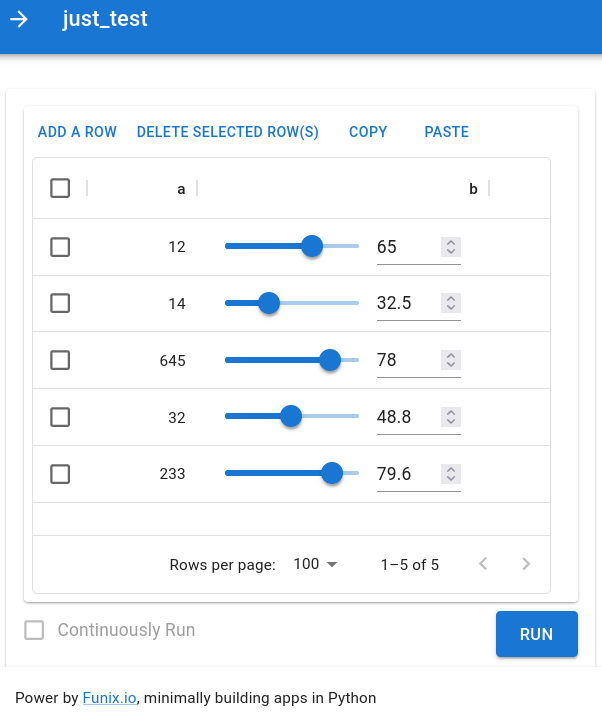
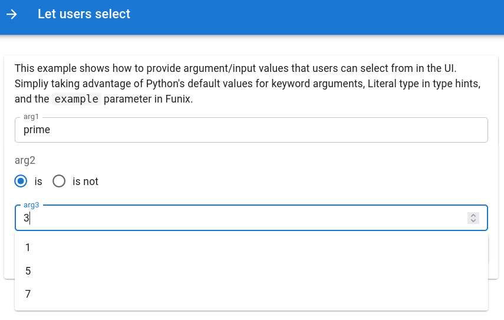
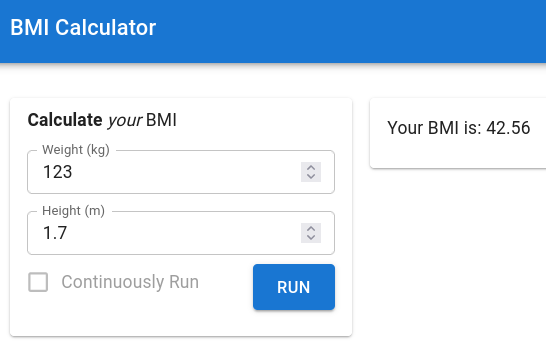
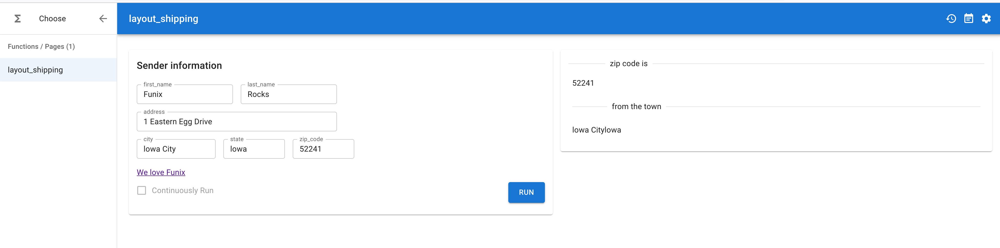
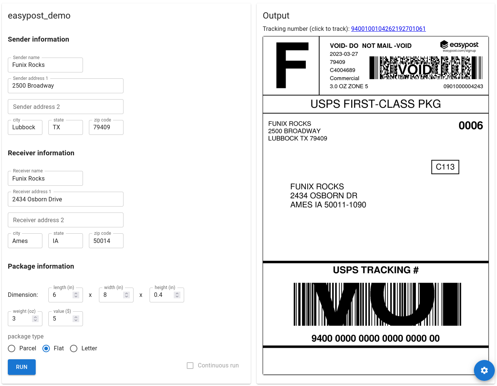
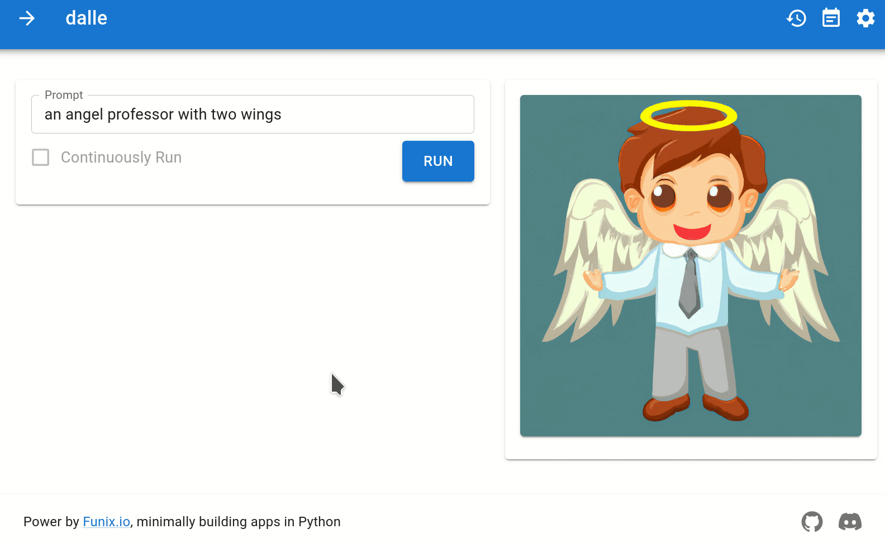
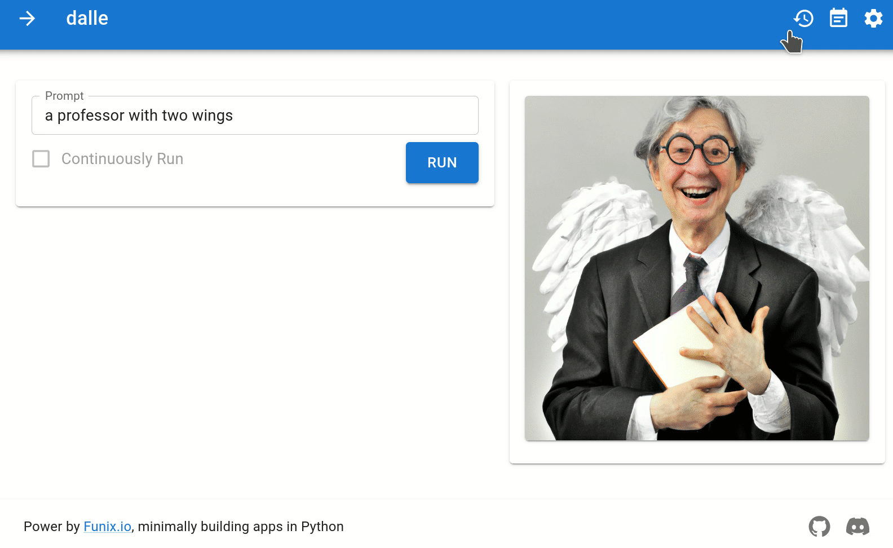
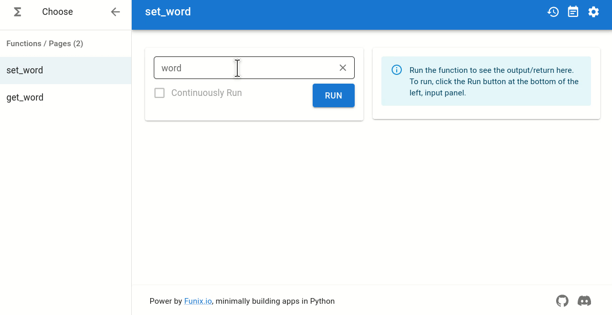
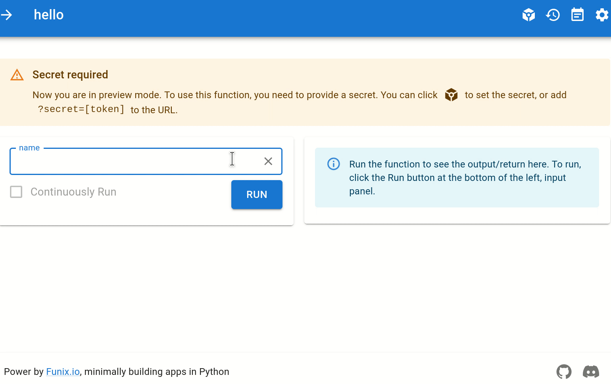

# The Reference Manual of Funix 

This reference manual covers advanced features of Funix. If you are new to Funix, please read the [QuickStart Guide](QuickStart.md) first.  

## Turning Python functions into apps

### The lazy mode

Suppose you have a Python function defined in a file `hello.py`. Then you can convert it to a web app via Funix using the command 

```bash
funix -l hello.py # -l stands for lazy
```

The web app runs at `http://localhost:3000` in a browser window automatically popped. The arguments of the function are mapped to the input widgets of the web app. The return values of the function are displayed in the output widget.

### The decorator mode

If you used a Funix decorator to customize a Python function, e.g., 

```py
import funix
@funix.funix(
    labels={
          "x": "The number to be squared"
        }
    )
def square(x: int) -> int:
    return x * x
```

then the lazy mode and the `-l` flag is no longer needed, e.g., 

```sh
funix my_app.py
```

### The recursive mode
Funix can convert all `.py` files recursively from a local path to apps, e.g., 

```sh
funix -R ./demos # ./demos is a folder and -R stands for recursive 
```

### The Github mode 

To make life more convenient, Funix can directly convert functions in a Github repo to web apps, e.g., 

```sh
funix -g http://github.com/funix/funix \ # the repo
      -r examples \     # the folder under the repo
      -R    # recursively 

funix -g http://github.com/funix/funix \ # the repo
      -r examples \     # the folder under the repo
      demo.py    # a particular file
```

## Supported I/O types and widget customization

Funix supports a great variety of data types, including both Python's built-in ones, and commonly used ones such as `Figure` of `matplotlib`. 

> Funix does NOT recommend configuring the widgets for individual functions. This is a major difference between Funix and other Python-based app building frameworks. Funix believes this should be done via themes, to consistently create UIs across apps. Read the [themes](#themes) section for more details. 

### Input types and their widgets

To customize the widgets of a Funix-decorated function, use the Funix decorator attribute `widgets`. 
The value provided to `widgets` must be a `Dict[str|List[str], str|List]`, where a key represents a type (a `str`, e.g., `"str"`) while a value is 
a string (e.g., `"inputbox"`), or optionally for a parametric widget, a list of a string (widget name) and a dictionary (parameters and values), e.g., `["slider", {"min":0, "max":100, "step":2}]`. 
For example, the code below shows three syntaxes to associate an `int`/`float` to a slider: 

```python
import funix 
@funix.funix(
  widgets={
    "x": "slider",  # default min, max and range
    "y": "slider(-1, 1, 0.25)", # one str for all parameters
    "z1": ['slider', {"min": 1, "max": 2, "step": 0.1}],  
    "z2": ['slider', {"max": 2, "step": 0.1}],  # default min, custom max and step
    }
) 
def square(x: int, y: float, z1: float, z2: float) -> float:
    return x + y + z1 + z2
```

#### Basic types: 

* `int` and `float`
  * allowed widget names:
    * `input` (default): a text input box where only digits and up to one dot are allowed. The UI is [MUI's TextField type=number](https://mui.com/material-ui/react-text-field/#type-quot-number-quot). 
    * `slider`: a slider. You can optionally set the arguments `start`, `end`, and `step` using a function call syntax `slider(start, end, step)` or `["slider", {"min":min, "max":max, "step":step}]` -- in the latter case, not all three parameters need to be customized. For integers, the default values are `start=0`, `end=100`, and `step=1`. For floats, the default values are `start=0`, `end=1`, and `step=0.1`.  The UI is [MUI's Slider](https://mui.com/components/slider/).
* `str`
  * allowed widget names: 
    * `input` (default): a text input box. Only oneline. The UI is [MUI's TextField](https://mui.com/material-ui/react-text-field).  
    * `textarea`: Multiline text input with line breaks. The UI is [MUI's TextField with multiline support](https://mui.com/material-ui/react-text-field/#multiline).
* `bool`
  * allowed widget names: 
    * `checkbox` (default): a checkbox. The UI is [MUI's Checkbox](https://mui.com/components/checkboxes/).
    * `switch`: a switch. The UI is [MUI's Switch](https://mui.com/components/switches/).
* `range`
  * `range` type is a special type of Python, which is essentially a sequence of integers. 
  * allowed widget names:
    * `slider` (default). The `start`, `end`, and `step` values for `slider` are the same as those specified when initializing a `range`-type argument. The UI is [MUI's Slider](https://mui.com/components/slider/).
  * Examples: 
    * ```python
      def square(x: range(0, 100, 10)) -> int:
          return x * x
      ```

#### Compound types: 
* `typing.List[T]` (`typing` is Python's built-in module)
  * `T` can only be `int`, `float`, `str` or `bool`
  * Elements of `typing.List[T]` will be collectively displayed in one widget together.
  * allowed widget names:
    * `simplearray` (default): The collective UI is [RJSF ArrayField](https://rjsf-team.github.io/react-jsonschema-form/), while the UIs for elements are the default one for type `T`. 
    * `[simplearray, WIDGET_OF_BASIC_TYPE]`: This option allows customizing the UI for elements.  `WIDGET_OF_BASIC_TYPE` is a widget name for a basic data type above. The collective UI is [RJSF ArrayField](https://rjsf-team.github.io/react-jsonschema-form/) while the UIs for elements are per `WIDGET_OF_BASIC_TYPE`. 
    * `sheet`: All function arguments of this type will be displayed in an Excel-like sheet. The collective UI is [MUIX DataGrid](https://mui.com/x/react-data-grid/) while the UIs for elements are the default one for type `T`. 
    * `[sheet, WIDGET_OF_BASIC_TYPE]`: This option allows customizing the UI for elements. Usage is similar to that of `[simplearray, WIDGET_OF_BASIC_TYPE]` above. 
    * `json`: JSON string laid out with toggles, indentations, and syntax highlights. The UI is [React-Json-View](https://github.com/mac-s-g/react-json-view). 
  * Examples (To add and must add)
* `typing.TypedDict` (`typing` is Python's built-in module)
  * allowed widget names: 
    * `json` (default and only): Any value or key in the dict can be of type `int`, `float`, `str` or `bool` only. The UI is [React-Json-View](https://github.com/mac-s-g/react-json-view) 
* `list`, `dict`, `typing.Dict` (`typing` is Python's built-in module) 
  * allowed widget names: 
    * `json` (default and only): The UI is [React-Json-View](https://github.com/mac-s-g/react-json-view).
* `typing.Literal` (`typing` is Python's built-in module)
  * allowed widget names: 
    * `radio` (default): a radio button group. The UI is [MUI's Radio](https://mui.com/components/radio-buttons/).
    * `select`: a dropdown menu. The UI is [MUI's Select](https://mui.com/components/selects/).
* Examples
  * Source: [examples/nest.py](../examples/nest.py)
    ```python
      import funix
      from typing import List

      @funix.funix({
        "widgets" : {
            "a": "sheet", 
            "b": ["sheet", 'slider[0, 100.0, 0.1]']
          }
      })
      def just_test(a: List[int], b: List[float]) -> dict:
        return {"a": a, "b": b}
    ```
    

#### Funix's additional types
Via the module `funix.widget.builtin`, Funix adds widgets to allow users to drag-and-drop MIME files as a web app's inputs. They will be converted into Python's `bytes` type. 

* `funix.widget.builtin.BytesFile`
  * Examples: 
    * [ChatPDF](https://github.com/forrestbao/ChatPaper), a web app using ChatGPT API to query information in a user-uploaded PDF file. 


### Output types and widgets
Funix supports the following output types. 

#### Python native ones 
* `int`, `float`: Displayed as `<code></code>`
* `str`: Displayed as `<span></span>`
* `bool`: Displayed as [MUI Checkbox](https://mui.com/material-ui/react-checkbox/)
* `typing.List` and `list`: Displayed in either React-JSON-Viewer or MUIX DataGrid. There will be a radio box on the front end for the user to switch between the two display options at any time, and the JSON Viewer will be used by default.
* `typing.TypedDict`, `typing.Dict`, `dict`: Displayed as ibid. 

#### Additional MIME types
To facilitate the rendering of MIME types, we introduce a module `funix.hint`. 
* `funix.hint.Figure`: For interactively displaying matplotlib plots. Currently, only 2D figures of matplotlib are supported. Rendered as [Mpld3 Plot](https://mpld3.github.io/)
* `funix.hint.Markdown`: For rendering strings that are in Markdown syntax. It's okay if the type is simply `str` -- but you will lose the syntax rendering. Rendered into HTML via [Markdown-it](https://markdown-it.github.io/) 
* `funix.hint.HTML`: For rendering strings that are in HTML syntax. It's okay if the type is simply `str` -- but you will lose the syntax rendering. Displayed into a `<div></div>` tag. 
* `funix.hint.Images`, `funix.hint.Videos`, `funix.hint.Audios`, `Funix.hint.Files`: For rendering URLs (either a `str` or a `typing.List[str]`) into images, vidoes, audios, and file downloaders. The URL(s) is(are) either a local path (absolute or relative) or web URI links, e.g., at AWS S3.
  * Examples 
<!-- FIXME: plural or singular?  -->
* `Code`: For rendering a string as a code block. Rendered using [React Syntax Highlighter Prism]

## Setting the default and example values in widgets
Quite often, a web app has default or example values prefilled at widgets for convenience. Funix provides handy solutions to support them. 

Default values can be set using Python's built-in default value for keyword arguments. 

<!-- add example -->

There is no Python's built-in way to set example values. Funix provides a decorator attribute `examples` to support it. The value to be provided to `examples` attribute is a `Dict[str, typing.List[Any]]` where the key is an argument name and the value is a list of example values.

Example 1: 
```python
import typing

from funix import funix

@funix(
        examples={"arg2": [1, 5, 7]}, 
        widgets={"arg1": "radio"}
)
def argument_selection(
        arg1: typing.Literal["is", "is not"]="is not", 
        arg2: str="prime",
        ) -> str:
    return f"The number {arg1} {arg2} {arg3}."

```



Example 2: 

```python
import funix
import typing
import openai 
openai.api_key = os.environ.get("OPENAI_KEY")

@funix.funix(
    prompt = ["Who is Einstein?", "Tell me a joke. "]
)
def ChatGPT_single_turn(
    prompt: str,
    model : typing.Literal['gpt-3.5-turbo', 'gpt-3.5-turbo-0301'] = 'gpt-3.5-turbo'
) -> str:
    completion = openai.ChatCompletion.create(
        messages=[{"role": "user", "content": prompt}],
        model=model
    )
    return f'ChatGPT says:  {completion["choices"][0]["message"]["content"]}'
```

<!-- Add screenshot -->

## Naming your app or widgets
To help users understand your app or widgets, you can explain them using the decorator attributes `description` and `argument_labels` respectively. The value provided to `description` is a Markdown-syntax string. The value provided to `argument_labels` is of the type `Dict[str, str]` where the key is an argument name and the value is a Markdown-syntax string.

Example 1: 
```python
import funix

@funix.funix(
    description = "**Calculate** _your_ BMI", 
    argument_labels = {
        "weight": "Weight (kg)", 
        "height": "Height (m)"
    }
)
def BMI(weight: float, height: float) -> str:
    bmi = weight / (height**2)
    return f"Your BMI is: {bmi:.2f}"
```




## Customizing layouts 

By default, Funix puts the input and output widgets in two panels that are put side-by-side, respectively.
In either panel, widgets are laid out in the order they appear in the function's signature, one-widget per line and top-down. 


### Customizing the panel arrangement 

The input and output panel are by default placed left to right. You can change their order and orientation using the `direction` attribute in a Funix decorator. The example below shall be self-explaining: 

```py
import funix 

@funix.funix()
def foo_default(x:int) -> str: 
    return f"{x} appears to the row, default"

@funix.funix(
    direction="column"
)
def foo_bottom(x:int) -> str: 
    return f"{x} appears at the bottom"

@funix.funix(
    direction="column-reverse"
)
def foo_top(x:int) -> str: 
    return f"{x} appears at the top"

@funix.funix(
    direction="row-reverse"
)
def foo_left(x:int) -> str: 
    return f"{x} appears to the left"    
```

A more advanced example is our ChatGPT multiturn app where `direction = "column-reverse"` so the message you type stays at the bottom. The source code can be found in `examples/AI/chatGPT_multi_turn.py`. Here is the screenshot:


### Customizing the widget layout

The input and output layout can be customized via the attribute `input_layout` and `output_layout` that use a row-based layout system where each row is a list of cells. Each cell is a dictionary that specifies the widget type & name and the number of columns it occupies. 
The type of `input_layout` and `output_layout` is : 
```python 
typing.List[  # each row 
  typing.List[ # each cell in the same row
    typing.Dict[str, str|int]  # see below 
  ]
]
``` 

The per-cell dictionary must have one entry, whose 
* **key** specifies the widget type, which is a string "argument" (if the widget is an input/argument), "return" (if the widget is an output/return), "markdown", "html", or "divider". 
* **value** is the content of the widget
  * If the widget type is "argument", then the value is the argument name as a `str`. 
  * If the widget type is "return", then the value is the index of the return value as an `int`. 
  * If the widget type is "markdown" or "html", then the value is a Markdown- or HTML-syntax string. 
  * If the widget type is "divider", then the value is the text to be displayed on the divider. When the text is an empty string, then nothing is displayed.

Optionally, the per-cell dictionary can contain an entry of the string key `width` and the value being an integer. The value specifies the number of columns, as defined in [MUI's Grid](https://mui.com/material-ui/react-grid/), the cell occupies. The default value is 1.

Note that widgets not covered in `input_layout` or `output_layout` will be displayed in the default order and after those covered in `input_layout` and `output_layout`.

**Example 1** Source code: `examples/layout_simple.py` 

```python
@funix.funix(
  input_layout=[
    [{"markdown": "### Sender information"}],  # row 1 
    [
      {"argument": "first_name", "width": 3}, 
      {"argument": "last_name",  "width": 3}, 
    ],    # row 2 
    [{"argument": "address", "width": 6}], # row 3 
    [ # row 4 
      {"argument": "city",  "width": 2.5}, 
      {"argument": "state", "width": 2}, 
      {"argument": "zip_code",   "width": 2}
    ], 
    [{"html": "<a href='http://funix.io'>We love Funix</a>"}],  # row 5 
  ], 
  output_layout = [
    [{"divider":"zip code is ", "return": 2}], 
    [{"divider": "from the town", "return": 0, "return": 1}], 
  ]
)
def layout_shipping(
    first_name: str, 
    last_name: str, 
    address: str, 
    city: str,
    state: str, 
    zip_code: str 
    )-> (str, str, str):
    return city, state, zip_code
```


**Example 2: Using EasyPost API** Source code: `examples/layout_easypost_shipping.py`



## Conditional input widget display

Funix allows controlling the appearance of input widgets based on the values of other widgets via the attribute `conditional_visible` which is of the type: 

```py
typing.List[ # a series of rules
  typing.TypedDict( # each rule 
    "show": typing.List[str] # arguments visible only       
    "when": typing.List[     # when conjuction of conditions holds
        typing.Dict[str, Any]  # each condition
    ]
  )
]
```

`show`'s value is a list of argument name strings. 
`when`'s value is a list of dictionaries, representing a series of conditions whose conjunction must be True for arguments in corresponding `show` list to appear. 

If `when`'s value is 

```{"argument1": value1, "argument2": value2}```,

then it 
means the condition 

```argument1 == value1 && argument2 == value2```

**Example** (Source code `examples/conditional_simple.py`): 

```py
import typing 

import funix

@funix.funix(
    widgets={"prompt":"textarea", "model": "radio"}, 
    conditional_visible=[
        {
            "when": {"show_advanced": True,}, 
            "show": ["max_tokens", "model", "openai_key"]
        }
    ]
)
def ChatGPT_advanced(prompt: str, 
        show_advanced: bool = False,
        model : typing.Literal['gpt-3.5-turbo', 'gpt-3.5-turbo-0301']= 'gpt-3.5-turbo',
        max_tokens: range(100, 200, 20)=140,
        openai_key: str = "",)  -> str:      

    completion = openai.ChatCompletion.create(
        messages=[{"role": "user", "content": prompt}],
        model=model, 
        max_tokens=max_tokens,
    )
    return completion["choices"][0]["message"]["content"]
```


## Per-argument configuration via `argument_config`

In all examples above, we provide values for each attribute (such as `widgets`, `examples`, or `argument_labels`) in a Funix decorator like this: 
```py
import funix
@funix.funix(
  attribute_name_1 = {
    argument_1: ...
    argument_2: ...
  }, 
  attribute_name_2 = {
    argument_1: ...
    argument_2: ...
  },
)
```

When there are many arguments, this may be inconvenient because different attributes of the same argument are scattered. 
Hence, Funix introduces a new attribute `argument_config` to support grouping all attributes of the same argument together. The example above can be rewritten as below: 

```py
import funix
@funix.funix(
  argument_config = {
    argument_1: {
      attribute_name_1: ... 
      attribute_name_2: ... 
    }, 
    argument_2: {
      attribute_name_1: ... 
      attribute_name_2: ... 
    }
  }
)
```

## Themes

One principle of Funix is to select the widget for a variable automatically based on its type without manual intervention, which is tedious, redundant, and inconsistent across multiple apps/functions.
The mapping from a type to a widget is defined in a theme. 

Besides controlling the type-to-widget mapping, a theme also controls other appearances of widgets, such as color, size, font, etc. In particular, Funix renders widgets using [Material UI, also called MUI](https://mui.com/). Thus a Funix theme gives users the direct access to MUI components and their properties.

### Defining a theme 

A theme defintion is a JSON dictionary of four parts: `name`, `widgets`, `props`, `typography`, and `palette`, like the example below: 

```json
  {
   "name" : "test_theme"
   "widgets": { # dict, map types to widgets 
        "str":     "inputbox",
        "int":     "slider[0,100,2]",
        "float":   ["slider", {"min": 0, "max": 100, "step": 2}],
        "Literal": "radio", 
    }, 
   "props": {
        "slider": {
          "color": "#99ff00"
        },
        "radio": {
          "size" : "medium" 
        } 
    }, 
    "typograhpy": {
        "fontSize": 16,    # font size, px
        "fontWeight[Light|Regular|Medium|Bold]": 500, # Font weight in light, regular, medium or bold
        "h1": {
            "fontFamily": "Droid Sans",   # Font family
            "letterSpacing": "0.2rem"     # Word spacing
        }
    }, 
    "palette": {
        "background": {
            "default": "#112233", # Default background color
            "paper": "#112233", # In <Paper /> color
        },
        "primary": {
          "main" : "#ddcc11",
          "contrastText" : "#d01234"
        }
    }
  }
```

A theme definition dictionary contains five fields, `name`, `widgets`, `props` `typography`, and `palette` that are all **optional**: 

- The value of the `name` field must be a string, defining the name of the theme. 
- The value of the `widgets` field is the same as the one for [the `widgets` attribute in a Funix decorator](#input-types-and-their-widgets) which is a `Dict[str|List[str], str|List]`, where a key represents a type (a `str`, e.g., `"str"`) while a value is a string (e.g., `"inputbox"`), or optionally for a parametric widget, a list of a string (widget name) and a dictionary (parameters and values), e.g., `["slider", {"max":10, "step":2}]`. 
- As a dictionary, the `props` field maps Funix widgets (a `str`) to their Material-UI props (a `dict`). It gives a user direct access to `props` of an MUI component. In the example above, we set [the `color` prop of MUI's `slider`](https://mui.com/material-ui/api/slider/#Slider-prop-color) and [the `size` prop of MUI's `radio`](https://mui.com/material-ui/api/radio/#Radio-prop-size). 
- The `typograph` field is a subset of the `typograph` field in a [MUI theme object](https://mui.com/material-ui/customization/default-theme/?expand-path=$.typography), expressed as a nested dictionary. 
- Similar to the `typograph` field, the `palette` field is a subset of the `palette` field in a [MUI theme object](https://mui.com/material-ui/customization/default-theme/?expand-path=$.typography), expressed as a nested dictionary. 

### (Optional) Importing a theme or defining a theme on-the-fly

You can import a theme from 
* a local file path, 
* a web URL, or
* a JSON string defined on-the-fly. 

You can then use the name (provided in the theme definition) or the alias to refer to the theme later. 

The example below renames two themes imported by the `alias` argument. 

```py
import funix 

# Importing from web URL 
funix.import_theme(
  "http://example.com/my_themes.json", 
  alias = "my_favorite_theme") # optional


# Importing from local file

funix.import_theme(
  "../my_themes.json", 
  alias = "my_favorite_theme") # optional
```

The example below define a theme on-the-fly and imports it (without aliasing it) for later use. 

```py

import funix 

theme_json = {
  # theme definition
  "name": "grandma's secret theme"
  "widgets" : {
    "range" : "inputbox" 
  }
}

funix.import_theme(theme_json = theme_json)
```

### Using a theme

A theme can be applied to all functions in one `.py` Python script from 
* a web URL
* a local file path
* a theme name imported earlier

using the `set_theme()` function. 
If you have multiple `set_theme()` calls, then the last one will overwrite all above ones. 


```py
import funix 
funix.set_theme("https://raw.githubusercontent.com/TexteaInc/funix-doc/main/examples/sunset_v2.json") # from web URL 

funix.set_theme("../..//sunset_v2.json") # from local file 

funix.set_theme("my_favorite_theme") # from alias or name
```


Alternatively, a theme can be applied to a particular function, again, from a web URL, a local file path, or a theme name/aliasL 
```python
import funix

@funix.funix(theme = "https://raw.githubusercontent.com/TexteaInc/funix-doc/main/examples/sunset_v2.json")
def foo():
	 pass

@funix.funix(theme = "../../themes/sunset_v2.json")
def foo():
	 pass

@funix.funix(theme = "grandma's secret theme") # "sunset" is a theme alias
def foo():
	 pass
```

## Call history

Funix automatically logs the calls of an app in your browser for you to review the history later. This can be particularly useful when you want to compare the outputs of an app given different inputs, e.g., different conversations with ChatGPT. Funix offers two ways to view the history: the rightbar and the comprehensive log. 

The history rightbar can be toggled like in GIF below. All calls are timestamps. Clicking on one history call will popular the input and output of the call to the input and output widgets. You can further (re)name, delete and export (to JSON) each call. 



A comprehensive log can be toggled by clicking the clock icon at the top right corner of a Funix-converted app. The inputs and outputs of each call are presented in JSON trees. You can jump from the JSON tree to the UI with the inputs and outputs populated by clicking the "View" button under a call. Note that the comprehensive log presents calls for all Funix-converted apps in your browser, unlike the history rightbar which displays history per-app. 

 

## Multipage apps and sessions

Building a multipage app in Funix is easy: one function becomes one page and you can switch between pages using the function selector. Passing data between pages are done via global variables. Simply use the `global` keyword of Python. 

```python
def set_word(word: str) -> str:
    global user_word
    user_word = word
    return "Success"

def get_word() -> str:
    return user_word
```



### Linking pages together via `prefilling`

A special case of passing data across pages is to pass (part of) the output of a function to an input of another. 
Funix supports this via the `prefill` attribute of a Funix decorator. For example, 

```py
import funix

def first_action(x: int) -> int:
    return x - 1

def second_action(message: str) -> list[str]:
    return message.split(" ")

def third_action(x: int, y: int) -> dict:
    return {"x": x, "y": y}

@funix.funix(
    pre_fill={
        "a": first_action, 
        "b": (second_action, -1), 
        "c": (third_action, "x")}
    )
def final_action(a: int, b: str, c: int) -> str:
    return f"{a} {b} {c}"
```

This multi-page app has 4 pages/functions/steps. The results from  `{first, second, third}_action` are used collectively in the final one `final_action`. 

The `prefill` attribute takes in a dictionary of type 

```py
Dict[
  str,  # string of a function argument
    Callable |  # callable returns an int, float, str, or bool
    Tuple(Callable, int) |  # callable returns a sequence, int is the index
    Tuple (Callable, int|str) # callable returns a dict, int|str is the key
]
```
 
The key is a `str`, corresponding to an argument of the function being prefilled. 
The value can be of three cases:
1. a callable, if the callable has a non-compound return value -- in this case, the return of the callable is sent to the corresponding argument of the function being prefilled.
2. a tuple of a callable and an index, if the callable returns a sequence -- in this case, the return of the callable that match the index is sent to the corresponding argument of the function being prefilled. 
3. a tuple of a callable and a `str`, if the callable returns a dictionary -- in this case, the return of the callable and of the key is sent to the corresponding argument of the function being prefilled. 

### Sessions

Funix uses global variables to pass values across pages for multipage apps. However, the value of a global variable is shared among all users. This can be  dangerous. For example, an API token key is a global variable set in one page and used in the other. Then once a user sets the API token key in the former page, all other users can it freely in the latter page though they may not be able to see the token value. 

To avoid this situation, we need to sessionize each browser's connection to a Funix app. To do so, add the `-t` option when launching the `funix` command, e.g., 

```
funix openAI_demo.py -t
```


**Known bugs**: However, there are many cases that our simple AST-based solution does not cover. If sessions are not properly maintained, you can use two Funix functions to manually set and get a session-level global variable. 

```py
import funix 
@funix.funix()
def set_word(word: str) -> str:
    funix.set_global_variable("user_word", word)
    return "Success"


@funix.funix()
def get_word() -> str:
    return funix.get_global_variable("user_word")
```

## Secret 

Very often you wanna protect the access to your app. Funix offers a simple way to do that: generating a random token that needs to be attached to the URL in order to open the app in a browser. 

To do so, just toggle the command line option `secret` when launching a Funix app. You can provide a token or let Funix generate one for you.

```bash
funix  my_app.py --secret  my_secret_token # use a token provided by you
or 
funix  my_app.py --secret  True # randomly generate a token
```

The token, denoted as `TOKEN` in the rest of this seciton,  will be printed on the Terminal. For example, 

```bash
$ funix hello.py --secret True
Secrets:
---------------
Name: hello
Secret: 8c9f55d0eb74adbb3c87a445ea0ae92f
Link: http://127.0.0.1:3000/hello?secret=8c9f55d0eb74adbb3c87a445ea0ae92f
```

To access the app, you just append `?secret=TOKEN` in the app URL. In the example above, the URL to properly open the app is `http://127.0.0.1:3000/hello?secret=8c9f55d0eb74adbb3c87a445ea0ae92f`. Bad guys trying to access your app via `http://127.0.0.1:3000/hello` (no secrete in the URL) will not be able to run your app.

However, if you are not a bad guy but just a forgetful person, you can still access your app without the token in the URL. Just click the "secret" button on the top right corner of the app, and enter the secret in a pop-up window, then you can use the app.



> Note: This is not a strong way to protect your app. 

## Backend APIs

TBD. 

## Recursively 


